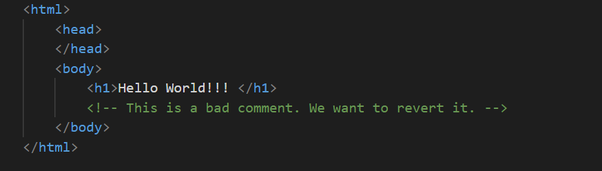
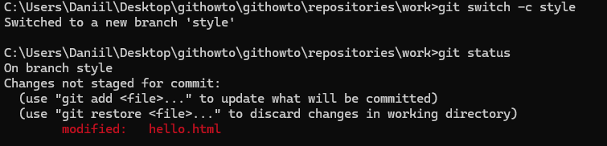
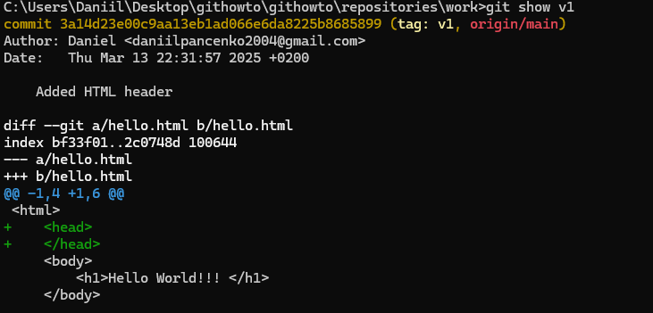
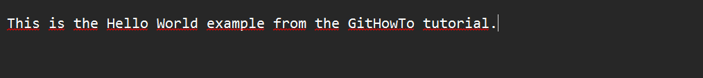

<h1>Завдання 2 Створення проєкту</h1>
Створюю сторінку «Hello, World»
Створюємо репозиторій та додаю сторінку

<h1>Завдання 3 Перевірка стану</h1>
Перевіряю стан репозиторію

<h1>Завдання 4 Внесення змін</h1>
Змінюю сторінку «Hello, World»

Перевіряю стан

<h1>Завдання 5  Індексація змін</h1>
Додаю зміни

<h1>Завдання 6 Індексація та коміт</h1>
Індексація змін та коміт за допомогою команди git commit< span>
<h1>Завдання 7 Коміт змін</h1>
  
Комітю зміни
  

  
Перевіряю стан

<h1>Завдання 8 Зміни, а не файли</h1>
Перша зміна: Додаю стандартні теги сторінок

  
Комітю зміни

Комітю зміни

<h1>Завдання 9 Історія проєкту</h1>

Зміни, а не файли

<h1>Завдання 10 Отримання старих версій</h1>

<h1>Завдання 11 Створення тегів версій</h1>

Теги для попередніх версій

<h1>Завдання 12 Скасування локальних змін (до індексації)</h1>

Змінюю hello.html

Скасовую зміни в робочій директорії

<h1>Завдання 13 Скасування проіндексованих змін (перед комітом)</h1>

<h1>Завдання 14 Скасування комітів</h1>

<h1>Завдання 15 Видалення комітів з гілки (revert)</h1>

<h1>Завдання 16 Видалення тегу oops</h1>

<h1>Завдання 17 Внесення змін до комітів</h1>

<h1>Завдання 18 Створення гілки</h1>

<h1>Завдання 19 Перемикання гілок</h1>

<h1>Завдання 20 Переміщення файлів</h1>

<h1>Завдання 21 Зміни в гілці main</h1>

<h1>Завдання 22 Перегляд розбіжних гілок</h1>

<h1>Завдання 23 Злиття</h1>

<h1>Завдання 24 Створення конфлікту</h1>

<h1>Завдання 25 Вирішення конфліктів</h1>

<h1>Завдання 27 Відкочування гілки style</h1>

<h1>Завдання 28 Перебазування</h1>

<h1>Завдання 29 Злиття в гілку main</h1>

<h1>Частина 2. Завдання 30 Клонування репозиторіїв</h1>

<h1>Завдання 31 Перегляд клонованого репозиторія</h1>

<h1>Завдання 32 Що таке origin?/h1>

<h1>Завдання 33 Віддалені гілки</h1>

<h1>Завдання 34 Зміна оригінального репозиторія</h1>

<h1>Завдання 35 Підтягування змін</h1>

<h1>Завдання 36 Злиття підтягнутих змін</h1>

<h1>Завдання 37 Додавання гілки відстеження</h1>

<h1>Завдання 38 Чисті репозиторії</h1>

<h1>Завдання 39 Додавання віддаленого репозиторія</h1>

<h1>Завдання 40 Відправка змін</h1>

<h1>Завдання 41 Підтягування спільних змін</h1>

<h1>Завдання 42 Розміщення ваших Git репозиторіїв</h1>

